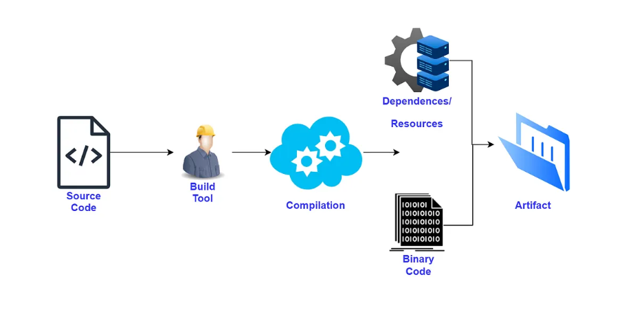
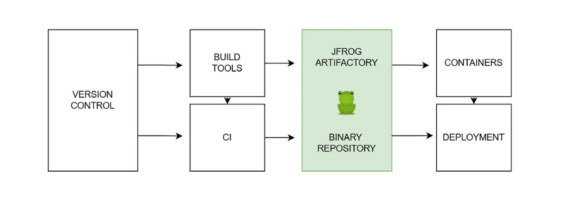

# Artifact

## What is Artifactory?
- Artifactory is a branded term to refer to a **repository manager** that organizes all of your binary resources. 
- These resources can include remote artifacts, proprietary libraries, and other third-party resources.
- A repository manager pulls all of these resources into a single location.
- The word **“Artifactory” refers to the JFrog product, the JFrog Artifactory**, but there are several other package managers out there such as [Package_Cloud](https://packagecloud.io/).
- Artifactory, and package managers at large, support build integration whether you are using one of the popular CI servers, building standalone without a CI server, or if you’re using a cloud-based CI server.
- Package managers can handle all dependencies and/or a build's artifacts as a single unit for bulk actions like exporting, moving, and copying.

## Are there other kinds of Artifact/Repository managers?
- JFrog Artifact
- Packagecloud
- Helix Core Version Control
- Archiva
- Cloudsmith
- npm

********

## JFrog 

**Note :** Google Drive for binaries.

**What is JFrog Artifact ?**
- JFrog Artifactory is a universal DevOps solution that manages and automates artifacts and binaries from start to finish during the application delivery process.

**Responsibilities:**
- Help in storing readily-deploy able code.
- Help in downloading and managing dependencies.

**Why should we use JFrog for Devops ?**
- System stability and reliability with artifactory high availability
  - the binaries needed are always available on JFrog once they are cached with it and there is certain assurance for their availability provided by company, 
  - But the same can't be said about an open source software which provide the same assurance. 
- Managing binaries across different environments
  - As the number of project in company grows, it becomes harder to maintain the number of binaries each of them use
  - To avoid chaos Jfrog manages the environments and the binaries.
- Security, access control and traceability
  - JFrog works on caching asset important to the company it keeps the system secure and keep track of metadata like which person logged  in at which time? and kind of changes or activity did they perform ? 
- Full support for Docker
  - storing and distributing images
- Quickly replicating remote repos in local
- Support for CHEFF

## Use Cases of JFrog
- Binary repository manager
- The place where you can store all your artifact
- Proxy for remote repos
- The place where we can store docker images
- Artifactory integration
- Faster release
- Business continuity ( Handling User actions )
- Orchestration tool
- Storage ready

## Resources 
- [Youtube](https://www.youtube.com/watch?v=a1B1jXXVzPQ)
- [Understanding the Basics of JFrog Artifactory](https://medium.com/@riimoonriimoon/understanding-the-basics-of-jfrog-artifactory-8167ce582c86)