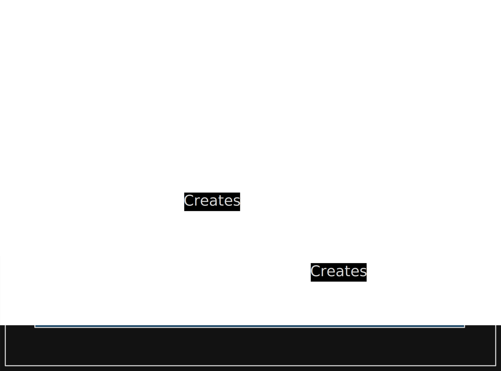

# Gradle

## Installation and setup 
- go to URL [Installation](https://gradle.org/releases/) and download the gradle
- unzip the folder 
- go to bin directory -> copy that path upto bin folder -> put that path in system path variable

## Fundamental 

- Gradle project
- Build Script
- Task
- Plugin

## Important File
- settings.gradle
- gradle/wrapper

## Commands
1) **gradle init**
   - to initialize the new project
2) **gradlew / gradle build**
   - w is refer to gradle wrapper and it's related to specific window machine
   - and only gradle is used for unix based system
   - It's start process build our project into jar/ war and stored that into lib folder
   - Stored that compiled file in build folder
3) **gradlew clean**
   - Delete the build folder

## Resources
[https://www.youtube.com/watch?v=SJKXJHKTRX8](https://www.youtube.com/watch?v=SJKXJHKTRX8)