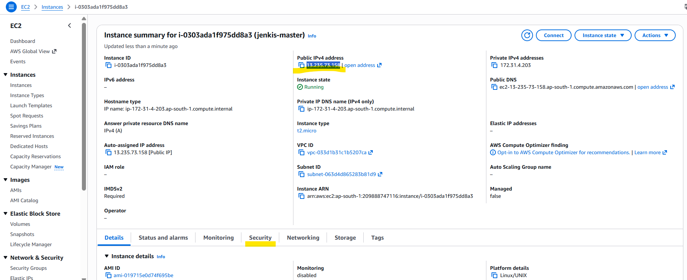
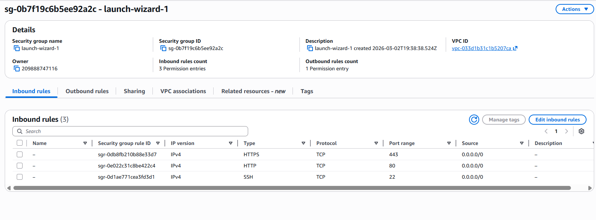
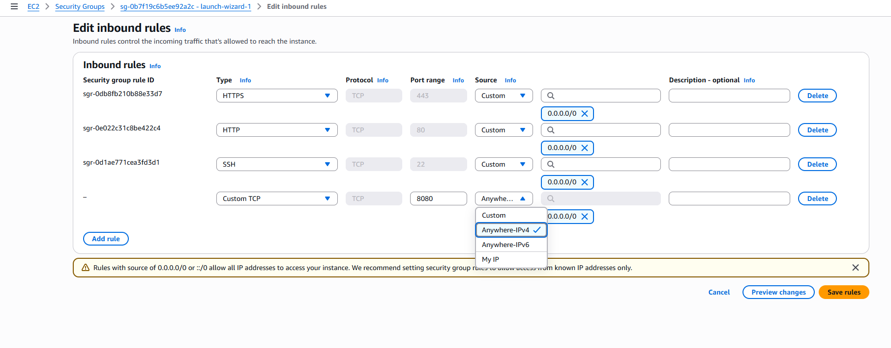

# EC2

## How we create EC2 instance ?


#### Q.How to make EC2 instance application public 

 1) Go to security 
2) find for security group and click on that


3) Check for inbound rule (incoming traffic) and click on **```Edit Inbound rule```**  the
   - We need to change Source-> custom to Source -> Anywhere-IPv4 / My IP
   - then click on save rule and refresh the page


