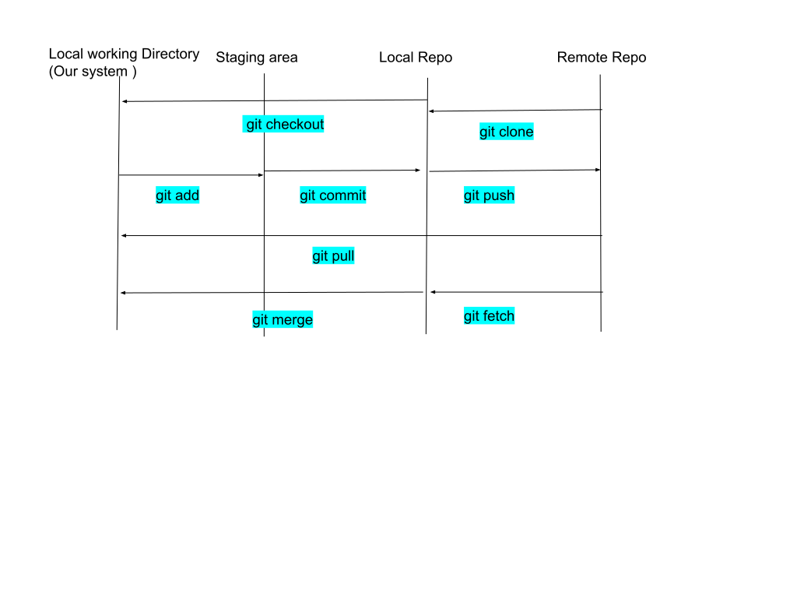

# Git Commands


**Note :**

While Pushing code to Remote repository and our local and remote repository is in unsync
then we are get face this challenges

**Step to solve**
1) First pull the changes from remote to local
2) Then add this changes from local to remote


## Architecture
1) Working Directory (Actively added file to locally)
2) Staging Area (Temporary spot before commiting)
3) Local Repository (Store locally commited file)
4) Repository (Original repository)


## Initialize Git
- **git init**	
  - To create new git repository and add .git hidden folder 	
  - To initialize the git repository in current folder
  - [git init | Atlassian Git Tutorial](https://www.atlassian.com/git/tutorials/setting-up-a-repository/git-init#:~:text=The%20git%20init%20command%20creates,run%20in%20a%20new%20project.)
- **git clone**	
  - To get existing remote repo project to local directory
- **Forking** 	
  - Another user Repo which doesn't have permission for commit and push command that repo add in our account repo	Creating copy of open source repo to your account repo where you have right to do changes

## Add Remote Repo URL
- **git remote**
  - This commad is for adding remote URL
  - ```
    git remote -v  // list of URL
    git remote add  <alias name>  <actual URL>  // add new URL
    git remote rename <oldName> <newName>
    ```

## Staging Area
- **git add**
  -  To track the file to commit on local repository
  - to add file in stage area
- **git stash**
  - Whenever we don't want to commit that file and we didn't want to loose that file.
  - after using git add command we go for commit phase and Didn't want to commit that file and take backup
    - ```
      - git stash clear      // to clear stash memory
      - git stash show stash@{<index of file>}      //  to check file
      - git stash list        // to check list of file in stash area
      - git stash pop      // retrieve stash area file to commit phase
      - git stash show   // to check how many files are there
    ```
- **git status**
  - To verify which file need to add or added in stag area.
- **git restore --stages <FileName>**
  - To remove file from stage area
- **git diff**
  - To check the difference between files
  - from staging
  - from commit  // with the use  hash ID
  - with branches
  - ```
      - git diff  // nonthing happen
      - git diff  --staged <stagingFile>
      - git diff <commitID1> <CommitId2>
      - git diff <branch1>..<branch2>
        note : Instead of space we can use .. (double dot) operator
    ```
    
## Local Repository Area
- **git commit**
  - to add staging file to local repo
  - **Follow Principle Atomic habit**
    - If your fixing 10 bug then 1 commit it get conflict while reverting changes
    - DO one thing at a one time
  - ```
       git commit -m "<message with present tense and impretive>"
    ```
  - REFERENCE : [https://www.youtube.com/watch?v=zTjRZNkhiEU&ab_channel=freeCodeCamp.org](https://www.youtube.com/watch?v=zTjRZNkhiEU&ab_channel=freeCodeCamp.org)
  - **Commit Log**
    - Get log of commited file with log id Display Id with hashed value commit file name message while commit

- **git restore <File_Name>** 
  - if we delete file from working directory and want to restore from local repository

- **git reset <hash_code value of commit>**
  - To remove previous commit from history

## Branches
- Like an alternatively timeline
```
git branch // to see list of branch
git chechout /  switch  <branch name>  // to switch branch 
git checkout -b <new branch name> // to create new branch and switch to them
git branch -M <RenameBranchName>  // update Curently Using Branch
```

- **Structure way to manage branch**
  - How do teams Handle all this branches
    ** with 5 Strategy Plan**
    - Feature branching
    - GitLab flow
    - GitHub flow
    - Git Flow
    - Trunk based development

- **Merging branches**
  - For fixing bug we created  branches and we need to add that changes in to main branch 
  - Two Type of Merging
    - Fast forward
    - Not fast forward
  ```
    // fire below command where you wana merge particular branch with current branch
    - git merge <Branch_name>
    // Other branch merge to current branch
    ```
- **Git Rebase (Don't use)**
  - **What :** alternative merge command but clear the all commit history
  - **Why :** To clean up commits
  - ```
        - git rebase <BranchName>
    BranchName(Other Branch) where we wanna to merge current branch
    ```

## Add Configuration
- To directly connect to our remote repo from local repo
  ```` 
    git config --global user.name <name of use>
    git config --global user.email <email of user>
        // To change the default editor
    git config --global core.editor <code editor name>
    git config --global core.editor // who is default code editor
  ````

## .gitignore file
- adding file name or path to ignore while commiting
- Inside this file we added such file that are randomly generated or we can generate through
   eg: node_modules, dist, maven


## Remote Repository
- **Git Push**
  - To save our code to remote repository
  ```
    - git push <Remote_URL_NAME> <Branch Name>
    - set upstream with the use of -u for future command git push
    - git push -u <Remote_URL_NAME> <Branch Name>
   ```
- **Pull Request**
  - to add our local changes to main repository 
  - For new branch for New pull request
  - Suppose you are working on 10 project or you have 10 new features
    at that time you save that code in existing branch then its difficult to understand
    which feature belongs it.


## Advanced (Steps to follow for Open source)
- **How**
  1) Talk to the people
  2) Open an issue
  3) Get Issue assigned
  4) Work and add value
  5) Make pull request and iterate over it
  6) Have patience
  7) Making Pull Request is not job guarantee
- **Step to add pull request**
  - Fork Repo
  - Clone the repo
  - Make changes
  - Create another branch to commit the changes
  - Push commit file through new branch where files are commited
  - you account will see the pull request
  - but we need to reflect this changes to original repo where we didn't have permission to commit
  - Add clear and understandable heder tag and description


## Reference 
- [Complete Git and GitHub Tutorial](https://www.youtube.com/watch?v=apGV9Kg7ics&list=PL9gnSGHSqcnr_DxHsP7AW9ftq0AtAyYqJ&index=4&ab_channel=KunalKushwaha)
- [What is version control | Atlassian Git Tutorial](https://www.atlassian.com/git/tutorials/what-is-version-control)