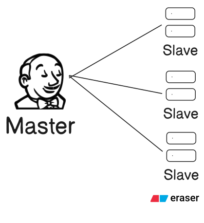

# Jenkins Core

1) [Jenkins Installation](Jenkins_Installation.md)
2) [Jenkins Job Creation](Jenkins_JobCreation.md)

## How it works
1) jenkins work on master and slave architecture 
2) Master where we need to install jenkins 
3) Slave doesn't require jenkins but want java  

