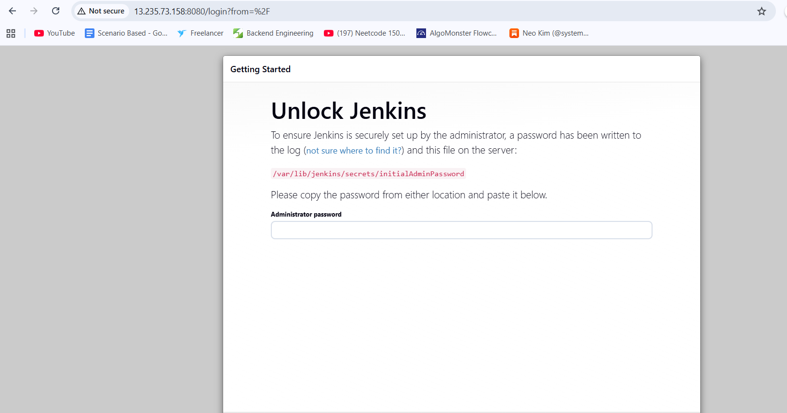
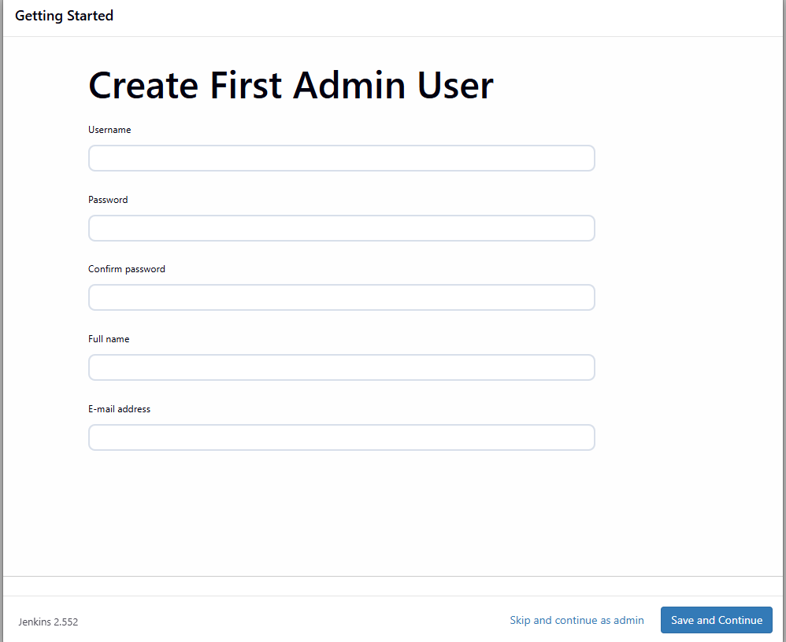
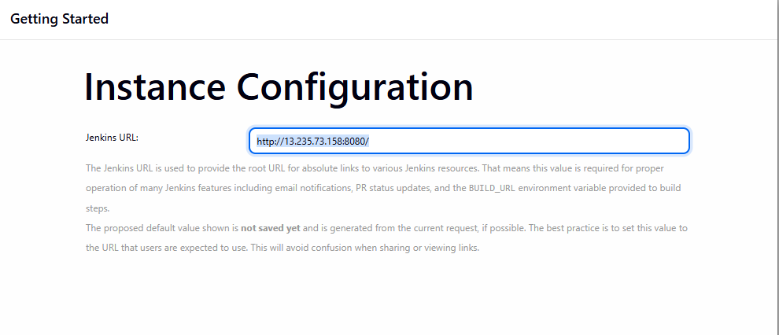

# Jenkins Installation

### How to set up Jenkins in AWS

**[Installation document](https://www.jenkins.io/doc/book/installing/linux/#debianubuntu)**

1) Installation of Java
```BASH

sudo apt update
sudo apt install fontconfig openjdk-21-jre
java -version
```

2) Installation of Jenkins
```Bash

sudo wget -O /etc/apt/keyrings/jenkins-keyring.asc \
  https://pkg.jenkins.io/debian-stable/jenkins.io-2026.key
  
echo "deb [signed-by=/etc/apt/keyrings/jenkins-keyring.asc]" \
  https://pkg.jenkins.io/debian-stable binary/ | sudo tee \
  /etc/apt/sources.list.d/jenkins.list > /dev/null
  
sudo apt update
sudo apt install jenkins 
```

3) After complete above step check jenkins running or not
```BASH

systemctl status jenkins
```

4) When we want start our jenkins application when the system get restart
```BASH
 
sudo systemctl enable jenkins
```

5)  How to make AWS jenkins public
     - Go to security
     - find for security group and click on that
     - Check for inbound rule (incoming traffic) and click on **```Edit Inbound rule```**  the
          - We need to change Source-> custom to Source -> Anywhere-IPv4 / My IP
          - then click on save rule and refresh the page
6) After completing above step you will find below screen for the first time
         
7) As per screenshot they provide us path to find administrator password 
``` 
sudo cat /var/lib/jenkins/secrets/initialAdminPassword 
```
8) After getting password 
   - put that password in password input box
   - click on done
9) then install jenkins suggested plugin 
10) After installation of suggested plugin you will see below window

    - username : admin
    - password / confirm : admin
    - fullname : amol salekar
    - Email address : amolsalekar0280@gmail.com
11) After completing all the steps you got an URL
