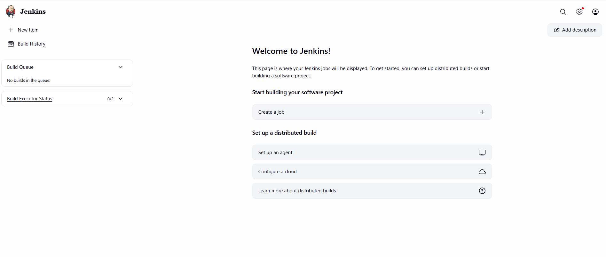
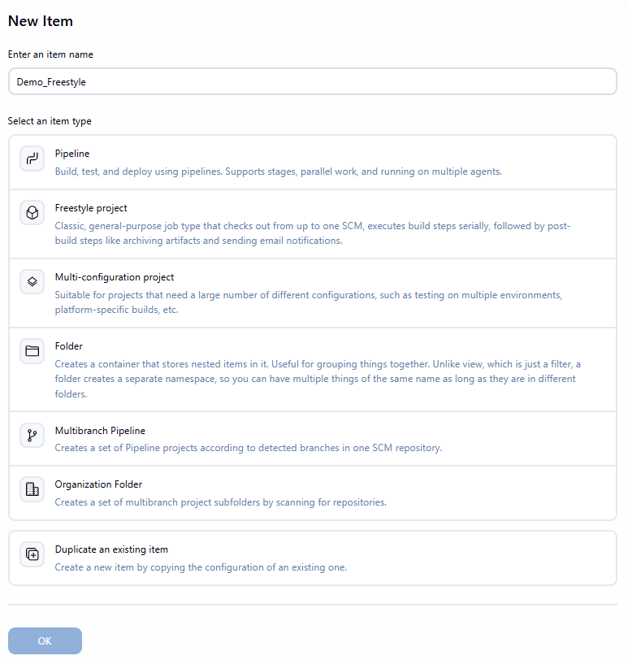

## Jenkins Job Creation

1) When you log on for the first time you see this window

   

2) Click create job or New Item then you see below window

3) Select the below one of job creation types according to your requirement

**Job Creation Types** 
1) FreeStyle Project
2) Pipeline
3) Multi-configuration
4) Folder
5) Multibranch Pipeline
6) Organization Folder
7) Duplicate an existing Item
8) 

