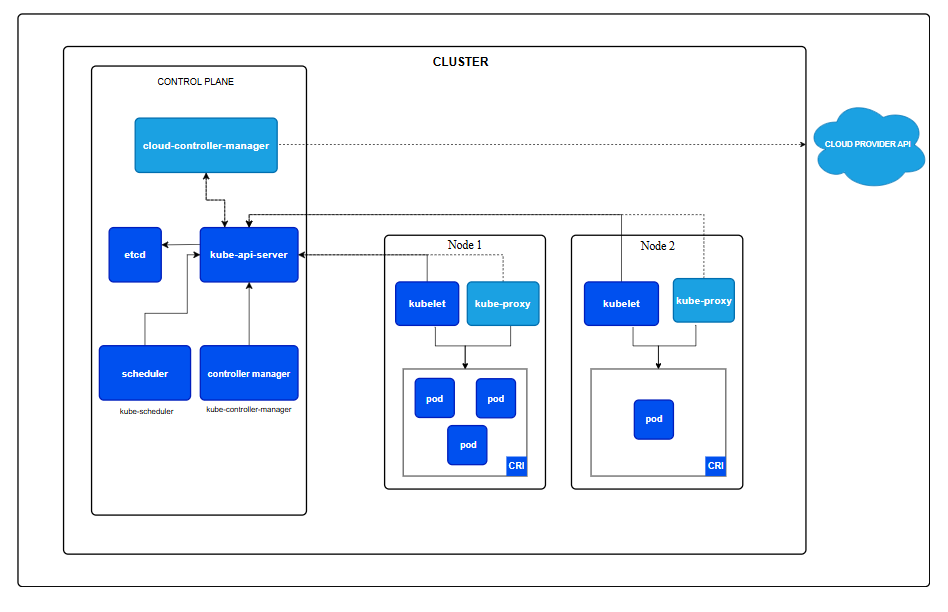

# K8S Architechture

- A ***Kubernetes cluster consists of a control plane plus a set of worker machines, called nodes***, that run containerized applications. 
- Every cluster needs at least one worker node in order to run Pods.
- The worker node(s) host the Pods that are the components of the application workload.
- The control plane manages the worker nodes and the Pods in the cluster.
- In **_production environments_**, the control plane usually runs across multiple computers and a cluster usually runs multiple nodes, providing fault-tolerance and high availability.

### Control plane components
