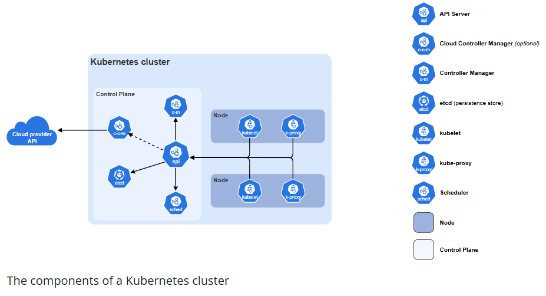

# Kubernetes

## Content
1) [Core Components](#core-components)

**Q. How Kubernetes get introduce to world ?** 

1) Borg ( Google developed this to manage container ). 
2) Later they developed from scratch and gave name as kubernetes.
3) It's also known as K8s because of K->S they have 8 letters.

**Other product for Container Orchestration other than Kubernetes:**
1) AWS ECS - Elastic Container Service
2) Ocean Service
3) Google Cloud Platform

## Core Components

**What it is?**
1) A Kubernetes cluster consists of a control plane and one or more worker nodes.

**Here's a brief overview of the main components.**
1) **Control Plane Components :** Manage the overall state of the cluster:
   - **kube-apiserver :**  The core component server that exposes the Kubernetes HTTP API.
   - **etcd :** Consistent and highly-available key value store for all API server data.
   - **kube-scheduler :** Looks for Pods not yet bound to a node, and assigns each Pod to a suitable node.
   - **kube-controller-manager :** Runs controllers to implement Kubernetes API behavior.
   - **cloud-controller-manager (optional) :** Integrates with underlying cloud provider(s).
2) **Node Components :** Run on every node, maintaining running pods and providing the Kubernetes runtime environment:
   - **kubelet :** Ensures that Pods are running, including their containers.
   - **kube-proxy (optional) :** Maintains network rules on nodes to implement Services.
   - **Container runtime :** You need to install a container runtime into each node in the cluster so that Pods can run there.

## Resources
1) [What is Kubernetes? | Kubernetes Explained](https://www.youtube.com/watch?v=a-nWPre5QYI)
2) [Kubernetes Architecture official Documentation ](https://kubernetes.io/docs/concepts/architecture/)