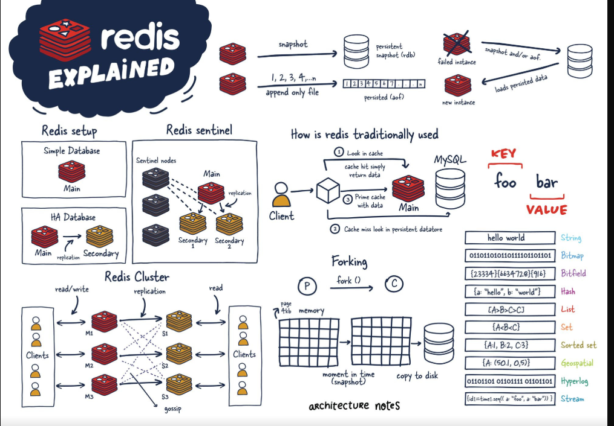

# Redis

### Content
- [Resources](#resources)
- [What is Redis ?](#what-is-redis-)
- [Redis core data types](#redis-core-data-types)
- [What make Redis so special](#what-make-redis-so-special)
- [Concurrent Programming models](#concurrent-programming-models-)
- [IO Multiplexing (Apparent Concurrency)](#io-multiplexing-apparent-concurrency)
- [Messaging with Redis](#messaging-with-redis)
- [Running Redis across multiple servers](#running-redis-across-multiple-servers)
- [Redis modules](#redis-modules)
- [Core, cross-cutting concepts](#core-cross-cutting-concepts)

#### Resources
1) [Redis - Hello Interview System Design in a Hurry](https://www.hellointerview.com/learn/system-design/deep-dives/redis)\
2) [Introduction_to_redis](https://www.educative.io/courses/building-practical-applications-with-redis-using-go/introduction-to-redis)

### What is Redis ?
1) Redis is an open-source, Single threaded, in-memory data structure.
2) It belongs to the NoSQL category of databases and falls under the key-value database umbrella.
3) It has been one of the leading databases in this category, according to DB-Engines ranking.
4) It can be used as Database, Message Broker, Cache, Streaming Engine

### Redis core data types
1) Redis’ core data types include String, List, Hash, Set, and Sorted Set.
2) Redis also has specialized features such as Redis Streams, Pub/Sub, Geospatial indexes, HyperLogLog, etc.
3) Although it’s an in-memory store, we can choose from a spectrum of persistence options.
4) It can act as a high-performance in-memory cache, a message broker, streaming engine, and can be used to solve a wide range of problems.

- String :
  - A basic Redis data type commonly used for caching, atomic counters, etc.
- Hash : 
  -  A Redis hash can store attribute-value pairs and is commonly used to model objects.
- Set :
  - A set can only contain unique elements, but doesn’t provide any ordering guarantees. 
  - It’s generally used to store data when duplicates can’t be tolerated, and it’s also used to represent relationships and execute operations such as union, intersection, etc.
- Sorted Set :
  - Items in a sorted set have a name and score associated with them. It’s similar to a set because it allows unique elements.
  - However, it differs from a set in that it provides ordering guarantees based on the member score—or name, if the scores are the same.
- Geospatial index :
  - This allows you to store and query latitude and longitude data (coordinates).
  - This is very useful for use cases that need to search for locations within a specific area, for example, finding restaurants within a five-mile radius.
- HyperLogLog :
  - This is a probabilistic data structure.
  - Its main use case is to count the unique number of elements. 
  - This sounds like a job for Set, but HyperLogLog is much more space-efficient for high data volume (millions of elements), and it sacrifices accuracy for optimizing storage.

**These Data structure Can be used to build variety of application**
- RealTimeChat
- Auth Session store
- Message Buffers
- Gaming leaders
- Media Streaming
- Realtime Analysis

### What make Redis so special
1) Every Operation in redis is Atomic 
( When command is executing Redis does not context switch and start executing another command )
- putting a key
- adding to list
- set union/intersection
- incrementing the value

### Concurrent Programming models 
Doing multiple things at same time

1) Multithreading 
- Each incoming RQ over the network is accepted by the server and executed in separate thread\
**Q.How to ensure data correctness ?**
  - We have to make other threads wait while one thread is executing the critical section
  - We have safeguard ( Pessimistic locking )
    1) Mutex
    2) Semaphore 

### IO Multiplexing (Apparent Concurrency)
This is How event loop are implemented

### Messaging with Redis
- List :
  - In addition to traditional operations like add, search, delete, etc., lists can be used to implement a consumer-producer pattern for reliable asynchronous job processing, also known as worker queues.
- Pub/Sub:
  - 1) This is an implementation of the Publish/Subscribe messaging paradigm.
    2) Redis allows producers to send data to channels, which can then be received by one or more consumers (subscribers).
  - 1) It provides a high-performance message bus, but it’s ephemeral.
    2) In other words, the messages are not persisted in Redis for offline consumers to receive them after they connect later.
- Streams :
  - 1) Streams also support the producer-consumer pattern, but messages are retained even after they’re consumed and processed.
    2) This is a powerful feature, similar to that of an append-only log structure.
  - 1) It also provides fault tolerance along with the ability to traverse the stream in a flexible way—
    2) for example, processing data from the beginning of a stream, processing only new data, and processing data from a specific point in time.
  
### Running Redis across multiple servers

**Description**
1) Redis is a high performance database, and we can go a long way with a single Redis server. 
2) But, it’s also possible to operate Redis across multiple servers if data requirements exceed the limitations of a single server. 
This also ensures high availability and redundancy.

**Types**
1) Redis Cluster :
   1) A Redis Cluster has multiple nodes and the data is partitioned (or sharded) into these nodes. 
   2) There should be a minimum of three primary nodes in a Cluster and each of them can have one or more replica nodes as well.
2) Redis Sentinel :
    1) This is a high-availability feature but doesn’t provide automatic data partitioning.
    2) The setup involves running a separate Cluster of Sentinel nodes that are configured to monitor a set of Redis servers and perform automatic remediation in case of server crashes or faults.
   3) This is a much more complex system and predates the Redis Cluster, which is the recommended solution for running Redis in a scale-out architecture.
3) Proxy: 
- A proxy setup involves relying on systems that can act as a middleman in front of a fleet of Redis servers. It also takes care of data partitioning using its own custom schemes.
   1) Server-side proxy: 
      - You can set up an intermediate server that speaks the Redis protocol and fans out requests to the appropriate Redis server. 
      - A popular solution is Twemproxy.
      
   2) Client-side proxy:
      - Instead of running a separate fleet of proxy servers, a client-side proxy is aware of all the Redis servers and knows how to partition data for storage and querying. 
      - All the logic is implemented in the client library itself.
### Redis modules
1) Redis modules are an advanced feature.
2) But, in simple terms, they allow you to implement custom data types specific to our use case without needing to change or update the core Redis server.
3) Implementing a new data type with Redis modules is a nontrivial effort.
4) There are many popular and widely used Redis modules to solve problems of full-text search (RediSearch), processing time series data at scale (RedisTimeSeries), native JSON support in Redis (RedisJSON), and much more.

### Core, cross-cutting concepts
1) Redis transactions
   - A transaction allows us to execute a group of actions (Redis commands) in an isolated way.
   - For example, during a transaction, other client requests are not served, and we can be sure that the data is only being accessed by a single client.
2) Pipelines
   - A pipeline can be used to execute multiple operations efficiently.
   - 1) Redis doesn’t return the response to back to the client.
     2) Instead, it queues the response in the memory and returns the responses after all the commands have been executed—this greatly reduces the round-trip time.
3) Lua scripts
   - You can use Lua to write server-side scripts that Redis can execute (similar to stored procedures).
   - This has a few advantages,
     1) atomicity (similar to a transaction, other client requests are blocked during a Lua Script execution),
     2) efficiency (data is processed where it’s present), and
     3) flexibility.