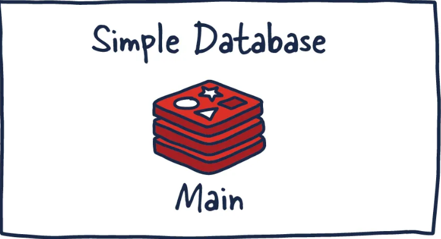
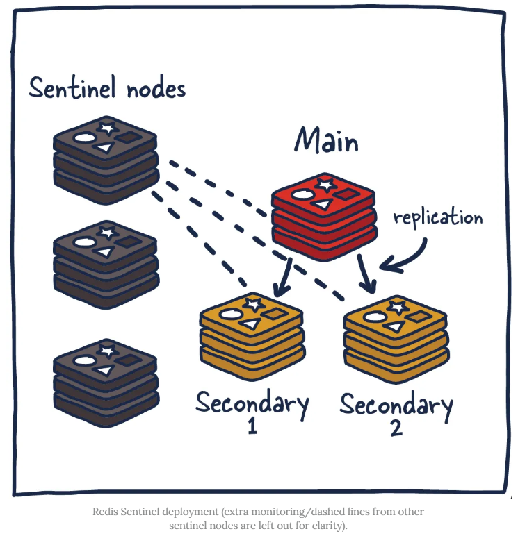

# Redis Architectures

**Types of Architectures**
1) **[Single Redis Instance](#single-redis-instance)**
2) **[Redis HA (Replication)](#redis-ha-high-availability-replication)**
3) **[Redis Sentinel (Distributed System) ](#redis-sentinel-distributed-system)**
4) **[Redis Cluster](RedisCluster.md)**

### 1) Single Redis Instance

Single Redis instance is the most $\color{red}{\textsf{straightforward deployment of Redis}}$ 
2) Allows users to set up and run small instances that can help them grow and speed up their services.

**Q. What if Fail?**
1) if this instance fails or is unavailable, **all client calls to Redis will fail** and therefore degrade the system's overall performance and speed.

**Q. How to make Powerful?**
1) **Given enough memory and server resources**, this instance can be powerful. 
2) A scenario primarily used for caching could result in a significant performance boost with minimal setup.
3) Given enough system resources, **you could deploy this Redis service on the same box the application is running**.

**Q. How redis manage data within the system**
1) Commands sent to Redis are first processed in memory.
2) Then, if persistence is set up on these instances, there is a forked process on some interval that facilitates data persistence RDB (very compact point-in-time representation of Redis data) snapshots or AOF (append-only files).
3) These two flows allow Redis to have long-term storage, support various replication strategies, and enable more complicated topologies
4) If **Redis isn't set up to persist data**, data is lost in case of a restart or failover.
5) If the **persistence is enabled** on a restart, it loads all of the data in the RDB snapshot or AOF back into memory, and then the instance can support new client requests.

### 2) Redis HA (High Availability) (Replication)
**[Redis Replication](RedisReplication.md)**

**Introduction**
1) High availability (HA) is a characteristic of a system that aims to ensure an agreed level of operational performance, **usually uptime, for a higher than average period**.
2) In these HA systems, it is **essential to not have a single point of failure so systems can recover gracefully and quickly**. 
3) This results in reliable crossover, so data isn't lost during the transition from primary to secondary, in addition to automatically detecting failure and recovery from it.

**Q. What it is?**
1) Redis is the **main deployment with a secondary deployment** that is kept in sync with **replication**. 
2) As **data is written to the main instance it sends copies of those commands, to a replica client** output buffer for secondary instances which facilitates replication.
3) The secondary instances can be one or more instances in your deployment. 
4) These instances can help scale reads from Redis or provide failover in case the main is lost.

### 3) Redis Sentinel (Distributed System)

**Q. What is Sentinel?**
1) It is **distributed monitoring and high-availability** system designed to manage Redis instances, providing automated failover, monitoring, and notification without manual intervention. 
2) It ensures that **if a master node fails, a replica is promoted to primary**, automatically reconfiguring clients to connect to the new master.

**Responsibilities**
1) 1) It ensures that the current main and secondary instances are functional and responding.
   2) This is necessary because sentinel (with other sentinel processes) can alert and act on situations where the main and/or secondary nodes are lost.
2) 1) It serves a role in service discovery much like Zookeeper and Consul in other systems.
   2)So when a new client attempts to write something to Redis,  Sentinel will tell the client what current main instance is.

So sentinels are **constantly monitoring availability and sending out that information to clients** so they are able to react to them if they indeed do failover.
1) **Monitoring —** ensuring main and secondary instances are working as expected.
2) **Notification —** notify system admins about occurrences in the Redis instances.
3) **Failover management —** Sentinel nodes can start a failover process if the primary instance isn't available and enough (quorum of) nodes agree that is true.
4) **Configuration management —** Sentinel nodes also serve as a point of discovery of the current main Redis instance.

**Redis Sentinel in this way allows for failure detection.**
1) This detection involves multiple sentinel processes agreeing that current main instance is no longer available. This agreement process is called **Quorum**.
2) This allows for increased robustness and protection against one machine misbehaving and being unable to reach the main Redis node.

**Quorum**
1) A quorum is the **minimum number of votes that a distributed system has to obtain** in order to be allowed to perform an operations like failover. 
2) This number is configurable, but should be reflective of the number of nodes in said distributed system. 
3) Most distributed systems have sizes of three or five with quorums of two and three respectively.
4) Odd number of nodes is prefferd in cases the system is required to break ties.

    